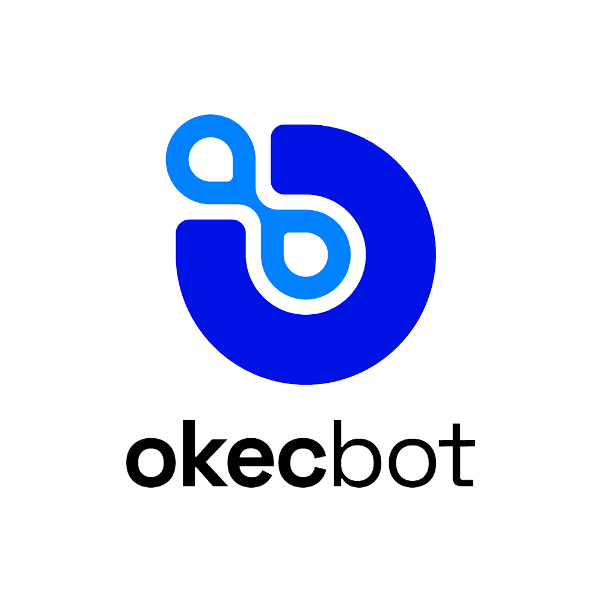

  

# Okecbot® Developer Knowledge Base

**Proprietary Notice**: This repository and all its contents are the exclusive property of Dannyokec Cyber Security and Software Programming Limited (RC: 2006105). Okecbot® is a registered trademark.

## 📖 Introduction

Welcome to the Okecbot® Developer Knowledge Base. This repository serves as the central hub for technical documentation, development guidelines, and organizational knowledge for the Okecbot® ecosystem.

## 📚 Documentation Index

### 🏗️ Core Architecture
- [System Architecture](architecture.md) - High-level technical design and system components
- [Branch & Release Guide](branch_tag_release_guide.md) - Version control and release management

### 👥 Working With Us
- [Career Opportunities](career.md) - Open positions and career growth at DCSSP
- [Contribution Guide](contributing/1-getting-started.md) - How to contribute to our projects
- [Development Workflow](contributing/2-development-workflow.md) - Our development processes and standards

### 🛠 Development Resources
- [Code Style & Standards](contributing/3-code-style.md) - Coding conventions and best practices
- [Testing Guidelines](contributing/4-testing.md) - Testing strategies and procedures
- [Pull Request Process](contributing/5-pull-requests.md) - How to submit and review code changes
- [Release Process](contributing/6-release-process.md) - Our software release lifecycle

### 📝 Templates
- [Issue Templates](issues-templates.md) - Standard templates for reporting issues
- [Contribution Guidelines](contribution.md) - Detailed contribution process

## 🏢 Organization Structure

| Repository | Purpose | Status |
|------------|---------|--------|
| `okecbot-desktop-app` | Main Electron application | Private |
| `okecbot-web-home` | Official website | Private |
| `okecbot-web-admin-client` | Admin portal | Private |
| `okecbot-web-user-client` | User dashboard | Private |
| `okecbot-web-api` | Backend API services | Private |
| `okecbot-marketplace-client` | P2P marketplace | Private |
| `okecbot-compile-assets` | Build resources | Private |
| `okecbot-public-library` | Documentation & resources | Public |

## 📜 Legal

- **Copyright**: © 2025 Dannyokec Cyber Security and Software Programming Ltd
- **Trademark**: Okecbot® is a registered trademark
- **RC Number**: 2006105
- **Location**: Abuja, Nigeria

---

  <strong>Okecbot®</strong> — If a human can do it on a browser, okecbot can automate it stealthily.
   
  <small>© 2025 Dannyokec Cyber Security and Software Programming Ltd. All rights reserved.</small>

