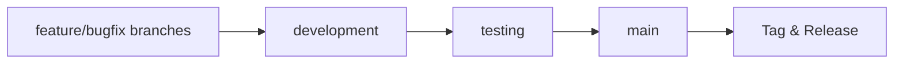

# Release Process

## Versioning

We follow [Semantic Versioning](https://semver.org/) (SemVer):

- **MAJOR** version for incompatible API changes
- **MINOR** version for backward-compatible functionality
- **PATCH** version for backward-compatible bug fixes

## Release Process Overview

### Branch Flow

All changes follow this progression:



### Release Types

1. **Feature Release** (Minor version bump: v1.X.0)
   - Scheduled every 2-4 weeks
   - Includes new features from `development`
   - Requires full regression testing

2. **Hotfix Release** (Patch version bump: v1.2.X)
   - For critical production fixes
   - Can be deployed directly to `main`
   - Must be merged back to `development` and `testing`

3. **Major Release** (vX.0.0)
   - For major updates or breaking changes
   - Requires stakeholder approval
   - Detailed migration guide needed

## Pre-Release Checklist

1. **Code Freeze**
   - No new features in the release branch
   - Only bug fixes and documentation updates

2. **Testing**
   - [ ] All tests pass
   - [ ] Manual testing completed
   - [ ] Performance testing completed
   - [ ] Security audit completed

3. **Documentation**
   - [ ] Changelog updated
   - [ ] Upgrade guide written (if needed)
   - [ ] API documentation updated

## Creating a Release

### 1. Prepare the Release Branch

```bash
# Ensure main is up to date
git checkout main
git pull

# Create release branch
git checkout -b release/vX.Y.Z

# Update version in package.json/version.php/etc.
# Update CHANGELOG.md with release notes
# Commit changes
git add .
git commit -m "chore(release): prepare vX.Y.Z"
```

### 2. Create Release Candidate (if needed)

```bash
# Tag the release candidate
git tag -a vX.Y.Z-rc.1 -m "Release candidate 1 for vX.Y.Z"

# Push the tag
git push origin vX.Y.Z-rc.1

# Notify QA team for final testing
```

### 3. Create Final Release

```bash
# Create version tag
git tag -a vX.Y.Z -m "Release vX.Y.Z"

# Push the tag
git push origin vX.Y.Z
```

### 4. Update Documentation

- Update version numbers in documentation
- Publish updated API docs
- Update any version-specific installation instructions

## Post-Release Tasks

1. **Merge Back to Develop**
   ```bash
   git checkout develop
   git merge --no-ff release/vX.Y.Z
   git push origin develop
   ```

2. **Clean Up**
   ```bash
   # Delete the release branch
   git branch -d release/vX.Y.Z
   git push origin --delete release/vX.Y.Z
   ```

3. **Announcement**
   - Send release email
   - Post on blog/social media
   - Update community channels

## Hotfix Process

1. **Create Hotfix Branch**
   ```bash
   git checkout -b hotfix/vX.Y.Z main
   ```

2. **Make Fixes**
   - Apply minimal changes needed
   - Add/update tests
   - Update CHANGELOG.md

3. **Release Hotfix**
   ```bash
   # Bump version
   git commit -m "fix: critical security patch for X"
   git tag -a vX.Y.Z -m "Hotfix vX.Y.Z"
   git push origin vX.Y.Z
   ```

4. **Merge Back**
   ```bash
   git checkout main
   git merge --no-ff hotfix/vX.Y.Z
   git checkout develop
   git merge --no-ff hotfix/vX.Y.Z
   ```

## Rollback Plan

1. **Identify Bad Release**
   ```bash
   git tag -l
   ```

2. **Revert the Release**
   ```bash
   # Revert the merge commit
   git revert -m 1 <merge-commit-hash>
   
   # Tag the reversion
   git tag -a vX.Y.Z+rollback -m "Rollback of vX.Y.Z"
   git push origin vX.Y.Z+rollback
   ```

3. **Communicate**
   - Notify all users
   - Update status page
   - Post-mortem analysis

## Release Communication Template

```markdown
# Okecbot vX.Y.Z Release Notes

## 🚀 New Features
- Added feature 1
- Added feature 2

## 🐛 Bug Fixes
- Fixed issue with login
- Resolved performance regression

## 🔧 Improvements
- Improved error messages
- Better mobile experience

## 📦 Installation

```bash
# Install with npm
npm install okecbot@X.Y.Z
```

## ⬆️ Upgrading
[Upgrade instructions]

## 📝 Changelog
[Link to full changelog]
```

## Next Steps
- [Getting Started →](../CONTRIBUTING.md)
- [Development Workflow →](2-development-workflow.md)
